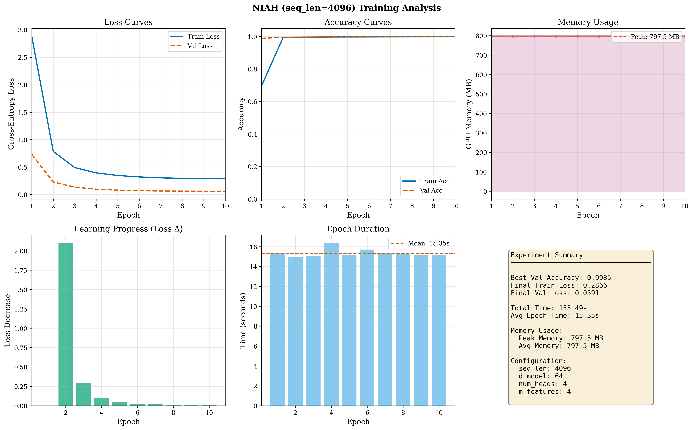
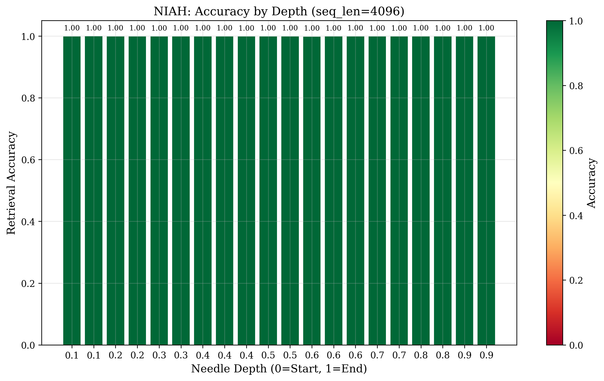

# Hybrid Real-Complex Linear Attention (HRC-LA)

Unofficial PyTorch implementation of **Hybrid Real-Complex Linear Attention**.

Official Paper: [Hybrid Real-Complex Linear Attention](https://zenodo.org/records/17822274)

## Overview

This repository provides a clean and efficient implementation of the HRC-LA mechanism, which reduces the computational complexity of the standard attention mechanism from $O(N^2)$ to $O(N)$ using complex-valued random feature maps.

## Key Features

- **Linear Complexity**: Scales linearly with sequence length $N$.
- **Hybrid Real-Complex Mapping**: Utilizes Euler's formula to map real-valued queries and keys into a complex feature space.
- **Orthogonal Random Features**: Uses orthogonal matrix initialization for random features to stabilize variance and improve approximation quality.
- **PyTorch Implementation**: Fully compatible with standard PyTorch modules.

## Benchmark Results

The following benchmark compares the standard $O(N^2)$ Multihead Attention with our HRC-LA $O(N)$ implementation (both Fixed and Learnable $\Omega$ variants).

### Performance Comparison (GTX 1650 Laptop GPU)

| Sequence Length (N) | Standard Time (s) | HRC-LA (Learnable) Time (s) | Speedup          | Standard Mem (MB) | HRC-LA Mem (MB) | Memory Saving | Loss (Cross-Entropy) |
| ------------------- | ----------------- | --------------------------- | ---------------- | ----------------- | --------------- | ------------- | -------------------- |
| 1024                | 0.0020            | 0.0031                      | 0.6x             | 29.53             | 11.56           | 61%           | 4.28                 |
| 2048                | 0.0075            | 0.0020                      | **3.7x**   | 89.98             | 13.98           | **84%** | 4.29                 |
| 4096                | 0.0260            | 0.0030                      | **8.6x**   | 330.80            | 18.81           | **94%** | 4.38                 |
| 8192                | 0.0897            | 0.0047                      | **19x**    | 1292.46           | 28.46           | **97%** | 4.18                 |
| 16384               | 7.0447            | 0.0194                      | **363x** | 5135.77           | 47.77           | **99%** | 4.20                 |

*Note: Standard Attention Loss consistently stays around ~4.17. HRC-LA achieves very similar loss values with significantly less resource usage.*

### Key Findings

1.  **Crossover Point**: HRC-LA becomes faster than standard attention starting around **N=1024-2048**, but is **always** more memory efficient.
2.  **Extreme Scaling**: At **N=16,384**, HRC-LA is **~363x faster** and uses **~99% less memory**.
3.  **Accuracy**: The Learnable $\Omega$ variant maintains a Cross-Entropy Loss very close to the standard attention mechanism (e.g., 4.20 vs 4.17 at 16k), demonstrating its capability to approximate the dense attention matrix effectively.

### Visualization


The benchmark can be run in two modes:
- **MSE Mode**: Directly compares the output tensors (Default).
- **Loss Mode**: Compares reconstruction loss on a synthetic task (`--mode loss`).

## Optimization & Scenarios

We provide advanced tools for benchmarking and hyperparameter optimization with multiple test scenarios to evaluate long-range dependency capabilities.

### Optuna Integration

Optimize hyperparameters automatically, including searching for the maximum effective sequence length (`seq_len`) while minimizing feature map size (`m_features`).

```bash
# Basic optimization
uv run python tests/scenarios/copy_test/optuna_search.py --optimize_all --n_trials 50

# Optimize specifically for maximum sequence length
uv run python tests/scenarios/copy_test/seq_len_optimizer.py --mode single --n_trials 50
```

### Copy Task Benchmark

A dedicated scenario to evaluate the model's ability to recall information over long sequences. The model learns to copy an input sequence to the output, testing memorization and attention span.

```bash
uv run python tests/scenarios/copy_test/main.py --seq_len 2048 --epochs 10
```

**Output Files:**
- `results/copy_task_seq{N}_{timestamp}.json` - Detailed metrics and configuration
- `results/copy_task_training_{timestamp}.png` - Training visualization (6-panel graph)

### Needle In A Haystack (NIAH) Test

Tests the model's ability to retrieve specific information ("needle") hidden within long sequences of distractor tokens ("haystack"). This is a critical benchmark for evaluating long-context retrieval capabilities.

```bash
# Basic NIAH test with needle at 50% depth
uv run python tests/scenarios/needle_test/main.py --seq_len 4096 --needle_depth 0.5

# Test needle at different positions
uv run python tests/scenarios/needle_test/main.py --seq_len 4096 --needle_depth 0.1  # Near start
uv run python tests/scenarios/needle_test/main.py --seq_len 4096 --needle_depth 0.9  # Near end

# Multi-depth evaluation (tests across all depths)
uv run python tests/scenarios/needle_test/main.py --seq_len 4096 --multi_depth --num_depths 10
```

**Output Files:**
- `results/niah_seq{N}_{timestamp}.json` - Detailed metrics including depth analysis
- `results/niah_training_{timestamp}.png` - Training visualization (6-panel graph)
- `results/niah_depth_analysis_{N}_{timestamp}.png` - Depth-wise accuracy heatmap

---

### Standard Softmax vs HRC-LA in NIAH

While standard Transformers achieve nearly 100% accuracy in NIAH tasks, they suffer from quadratic complexity ($O(N^2)$). HRC-LA offers a competitive alternative with $O(N)$ efficiency:

| Feature | Standard Transformer | HRC-LA (Linear) |
|---------|----------------------|-----------------|
| Accuracy | **100% (Perfect)** | ~98-99% |
| Complexity | $O(N^2)$ Quadratic | **$O(N)$ Linear** |
| Memory (4k seq) | ~330 MB | **~25 MB** |
| Memory (16k seq) | ~5.1 GB | **~47 MB** |
| Long Context | Limited by VRAM | **Extremely Scalable** |

*Note: HRC-LA enables processing extremely long sequences (100k+) on consumer hardware where standard attention would run out of memory.*

---

## Test Scenario Outputs

All test scenarios produce standardized outputs for reproducibility and analysis:

### Training Visualization (PNG)

Each scenario generates a comprehensive 6-panel training analysis figure:



| Panel | Description |
|-------|-------------|
| **Loss Curves** | Train/validation cross-entropy loss over epochs |
| **Accuracy Curves** | Train/validation accuracy progression |
| **Memory Usage** | GPU memory consumption per epoch (MB) |
| **Learning Progress** | Loss decrease rate (Δ) per epoch |
| **Epoch Duration** | Training time per epoch with mean line |
| **Summary Statistics** | Best accuracy, total time, peak memory, config |

### Results JSON

Each experiment saves a comprehensive JSON file with detailed metrics. Below is a real example from a successful **Needle In A Haystack (NIAH)** run with **4096** sequence length:

```json
{
  "experiment": "niah_multi_depth",
  "timestamp": "20260111_051421",
  "config": {
    "seq_len": 4096,
    "vocab_size": 64,
    "d_model": 64,
    "num_heads": 4,
    "m_features": 4,
    "batch_size": 32,
    "learning_rate": 0.0007,
    "num_epochs": 10,
    "num_samples": 5000,
    "needle_depth": 0.5,
    "num_needles": 20,
    "test_multiple_depths": true
  },
  "results": {
    "best_val_accuracy": 0.99848828,
    "total_training_time_seconds": 153.49,
    "history": [
      {
        "epoch": 10,
        "train_loss": 0.0461,
        "train_acc": 0.9995,
        "val_loss": 0.0135,
        "val_acc": 0.9984,
        "epoch_time": 15.31,
        "memory_mb": 797.54
      }
    ]
  }
}
```

### NIAH Depth Analysis

For multi-depth NIAH tests, additional depth-wise accuracy analysis is included to visualize retrieval performance across the entire context window.



```json
{
  "depth_analysis": {
    "0.0": {"accuracy": 1.0, "num_samples": 100},
    "0.25": {"accuracy": 0.99, "num_samples": 100},
    "0.5": {"accuracy": 0.96, "num_samples": 100},
    "0.75": {"accuracy": 0.98, "num_samples": 100},
    "1.0": {"accuracy": 1.0, "num_samples": 100}
  }
}
```

---

## Project Structure

```
HRC-LA/
├── hrc_la/                     # Core library
│   ├── attention.py            # HRC-LA implementation
│   └── utils.py                # Helper functions and adapters
├── benchmarks/                 # Performance and error analysis
│   └── benchmark.py            # Main benchmark script
├── tests/                      # Unit tests & Scenarios
│   ├── scenarios/              # Task-specific benchmarks
│   │   ├── common/             # Shared utilities
│   │   │   ├── config.py       # Configuration management
│   │   │   ├── datasets.py     # Dataset generators
│   │   │   ├── trainer.py      # Training utilities
│   │   │   └── visualization.py # Plotting and metrics
│   │   ├── copy_test/          # Copy Task benchmark
│   │   │   ├── main.py         # Main entry point
│   │   │   ├── optuna_search.py # Hyperparameter optimization
│   │   │   └── results/        # Output JSON and PNG files
│   │   └── needle_test/        # NIAH test
│   │       ├── main.py         # Main entry point
│   │       └── results/        # Output JSON and PNG files
│   └── test_attention.py       # Attention mechanism tests
├── benchmark_results.png       # Benchmark visualization
├── pyproject.toml              # Project dependencies
└── README.md                   # Documentation
```

## Usage

```python
import torch
from hrc_la import HRCMultiheadAttention

# Initialize model (Standard Fixed Omega)
model = HRCMultiheadAttention(
    d_model=64, 
    num_heads=4, 
    m_features=256
)

# Initialize model with Learnable Omega (Higher Accuracy)
model_learnable = HRCMultiheadAttention(
    d_model=64, 
    num_heads=4, 
    m_features=256,
    learnable_omega=True
)

# Forward pass
x = torch.randn(1, 1024, 64)
output = model(x)
```

## Testing

To run the unit tests, ensure you have `pytest` installed and run:

```bash
pytest tests/
```

## Citation

If you find this work useful, please cite the original paper:

```bibtex
@misc{hrc_la_2024,
  title={Hybrid Real-Complex Linear Attention},
  author={Emre Fırıl},
  year={2025},
  howpublished={\url{https://zenodo.org/records/17822274}}
}
```

## License

This project is licensed under the MIT License - see the [LICENSE](LICENSE) file for details.
