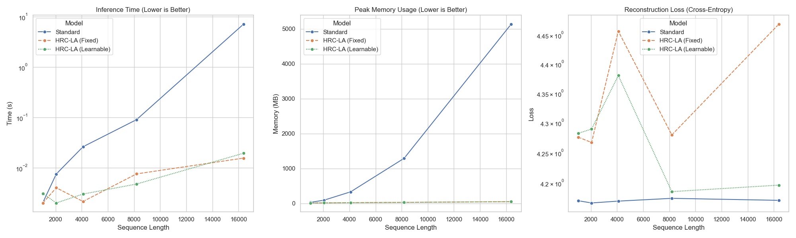

# Hybrid Real-Complex Linear Attention (HRC-LA)

Unofficial PyTorch implementation of **Hybrid Real-Complex Linear Attention**.

Official Paper: [Hybrid Real-Complex Linear Attention](https://zenodo.org/records/17822274)

## Overview

This repository provides a clean and efficient implementation of the HRC-LA mechanism, which reduces the computational complexity of the standard attention mechanism from $O(N^2)$ to $O(N)$ using complex-valued random feature maps.

## Key Features

- **Linear Complexity**: Scales linearly with sequence length $N$.
- **Hybrid Real-Complex Mapping**: Utilizes Euler's formula to map real-valued queries and keys into a complex feature space.
- **Orthogonal Random Features**: Uses orthogonal matrix initialization for random features to stabilize variance and improve approximation quality.
- **PyTorch Implementation**: Fully compatible with standard PyTorch modules.

## Benchmark Results

The following benchmark compares the standard $O(N^2)$ Multihead Attention with our HRC-LA $O(N)$ implementation (both Fixed and Learnable $\Omega$ variants).

### Performance Comparison (RTX 4060 Laptop GPU)

| Sequence Length (N) | Standard Time (s) | HRC-LA (Learnable) Time (s) | Speedup        | Standard Mem (MB) | HRC-LA Mem (MB) | Memory Saving | MSE (Learnable) |
| ------------------- | ----------------- | --------------------------- | -------------- | ----------------- | --------------- | ------------- | --------------- |
| 1024                | 0.0015            | 0.0035                      | 0.4x           | 31.19             | 50.34           | -61%          | 0.001650        |
| 2048                | 0.0061            | 0.0038                      | **1.6x** | 93.19             | 77.09           | **17%** | 0.000448        |
| 4096                | 0.0205            | 0.0070                      | **2.9x** | 336.94            | 144.58          | **57%** | 0.000323        |
| 8192                | 0.0783            | 0.0143                      | **5.5x** | 1304.44           | 279.70          | **78%** | 0.017169        |
| 16384               | 7.3582            | 0.0256                      | **287x** | 5159.44           | 549.95          | **89%** | 0.003315        |

### Key Findings

1. **Crossover Point**: HRC-LA becomes faster and more memory-efficient than standard attention at sequence lengths around **N=2048**.
2. **Extreme Scaling**: At **N=16,384**, HRC-LA is **~287x faster** and uses **~10x less memory**.
3. **Learnable vs Fixed**: The Learnable $\Omega$ variant significantly reduces approximation error (MSE) compared to the fixed variant, especially at longer sequence lengths (e.g., at N=16k, MSE drops from ~16.0 to ~0.003).

### Visualization



The plot above demonstrates the linear scaling of HRC-LA compared to the quadratic scaling of standard attention, while maintaining a very low approximation error (MSE).

## Project Structure

```
HRC-LA/
├── hrc_la/                # Core library
│   ├── attention.py       # HRC-LA implementation
│   └── utils.py           # Helper functions and adapters
├── benchmarks/            # Performance and error analysis
│   ├── benchmark.py       # Main benchmark script
├── tests/                 # Unit tests & Scenarios
│   ├── scenarios/         # Task-specific benchmarks (Copy Task, etc.)
│   └── test_attention.py  # Attention mechanism tests
├── benchmark_results.png  # Benchmark visualization
├── pyproject.toml         # Project dependencies
└── README.md              # Documentation
```

## Usage

```python
import torch
from hrc_la import HRCMultiheadAttention

# Initialize model (Standard Fixed Omega)
model = HRCMultiheadAttention(
    d_model=64, 
    num_heads=4, 
    m_features=256
)

# Initialize model with Learnable Omega (Higher Accuracy)
model_learnable = HRCMultiheadAttention(
    d_model=64, 
    num_heads=4, 
    m_features=256,
    learnable_omega=True
)

# Forward pass
x = torch.randn(1, 1024, 64)
output = model(x)
```

## Testing

To run the unit tests, ensure you have `pytest` installed and run:

```bash
pytest tests/
```

## Citation

If you find this work useful, please cite the original paper:

```bibtex
@misc{hrc_la_2024,
  title={Hybrid Real-Complex Linear Attention},
  author={Emre Fırıl},
  year={2025},
  howpublished={\url{https://zenodo.org/records/17822274}}
}
```

## License

This project is licensed under the MIT License - see the [LICENSE](LICENSE) file for details.
