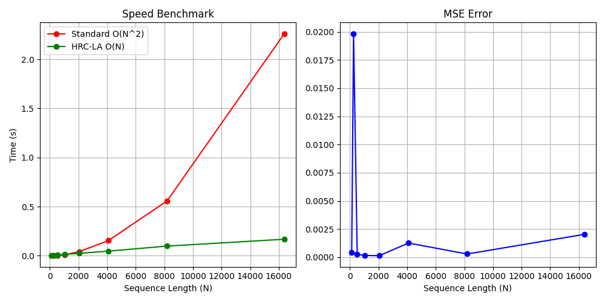

# Hybrid Real-Complex Linear Attention (HRC-LA)

Unofficial PyTorch implementation of **Hybrid Real-Complex Linear Attention**.

Official Paper: [Hybrid Real-Complex Linear Attention](https://zenodo.org/records/17822274)

## Overview

This repository provides a clean and efficient implementation of the HRC-LA mechanism, which reduces the computational complexity of the standard attention mechanism from $O(N^2)$ to $O(N)$ using complex-valued random feature maps.

## Key Features

- **Linear Complexity**: Scales linearly with sequence length $N$.
- **Hybrid Real-Complex Mapping**: Utilizes Euler's formula to map real-valued queries and keys into a complex feature space.
- **PyTorch Implementation**: Fully compatible with standard PyTorch modules.

## Benchmark Results

The following benchmark compares the standard $O(N^2)$ Multihead Attention with our HRC-LA $O(N)$ implementation.

### Performance Comparison

| Sequence Length (N) | Standard Time (s) | HRC-LA Time (s) | MSE Error |
|---------------------|-------------------|-----------------|-----------|
| 128                 | Fail              | 0.0010          | 0.000403  |
| 256                 | 0.0010            | 0.0045          | 0.019830  |
| 512                 | 0.0020            | 0.0075          | 0.000251  |
| 1024                | 0.0095            | 0.0136          | 0.000162  |
| 2048                | 0.0415            | 0.0240          | 0.000136  |
| 4096                | 0.1544            | 0.0466          | 0.001259  |
| 8192                | 0.5579            | 0.0978          | 0.000288  |
| 16384               | 2.2606            | 0.1675          | 0.002028  |

### Visualization



The plot above demonstrates the linear scaling of HRC-LA compared to the quadratic scaling of standard attention, while maintaining a very low approximation error (MSE).

## Project Structure

```
HRC-LA/
├── hrc_la/                # Core library
│   ├── attention.py       # HRC-LA implementation
│   └── utils.py           # Helper functions and adapters
├── benchmarks/            # Performance and error analysis
│   ├── benchmark.py       # Main benchmark script
│   └── decomposition.py   # Step-by-step implementation analysis
├── tests/                 # Unit tests
│   └── test_attention.py  # Attention mechanism tests
├── results.png            # Benchmark visualization
├── pyproject.toml         # Project dependencies
└── README.md              # Documentation
```

## Usage

```python
import torch
from hrc_la import HRCMultiheadAttention

# Initialize model
model = HRCMultiheadAttention(
    d_model=64, 
    num_heads=4, 
    m_features=256
)

# Forward pass
x = torch.randn(1, 1024, 64)
output = model(x)
```

## Testing

To run the unit tests, ensure you have `pytest` installed and run:

```bash
pytest tests/
```

## Citation

If you find this work useful, please cite the original paper:

```bibtex
@misc{hrc_la_2024,
  title={Hybrid Real-Complex Linear Attention},
  author={Emre Fırıl},
  year={2025},
  howpublished={\url{https://zenodo.org/records/17822274}}
}
```

## License

This project is licensed under the MIT License - see the [LICENSE](LICENSE) file for details.
